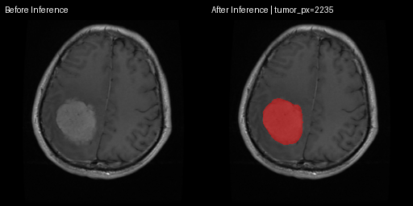
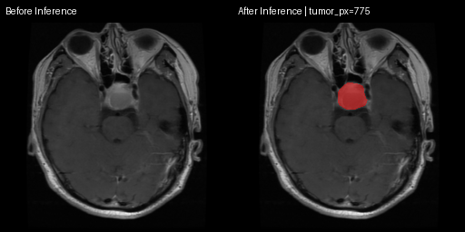
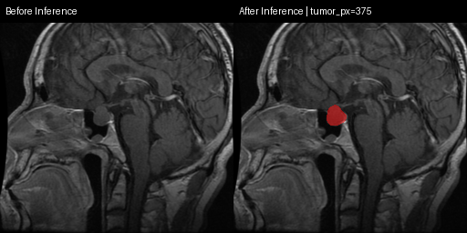
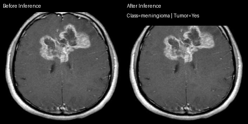
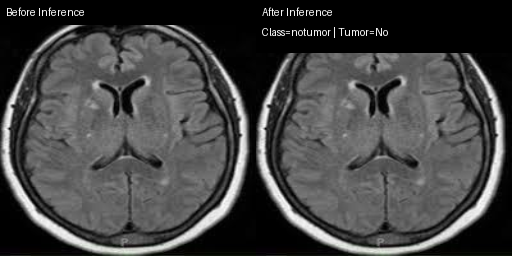

# Inference Examples and Experiment Data

This folder contains GitHub-tracked artifacts for:

- Before/after inference images (segmentation and classification)
- Key experiment result JSON files

## 1) Brain Tumor Segmentation (Before vs After Inference)

Setting used in these examples:
- 5-model ensemble
- consensus `>=2/5`
- threshold `0.39`
- postprocess `min_size=96`, `fill_holes=true`

### Example Images

Manifest:
- `inference_examples/segmentation/segmentation_examples_manifest.json`

## 2) Brain Tumor Classification (Tumor vs No Tumor)

- Left: before inference
- Right: after inference with predicted class and Tumor=Yes/No label

Manifest:
- `inference_examples/classification/classification_examples_manifest.json`

## 3) Experiment Data Uploaded

### Segmentation
- `experiment_data/segmentation/ensemble_5model_s43_besttest_post_sweep_20260501.json`
- `experiment_data/segmentation/ensemble_5model_s43_ultrafine_fullscan_20260501.json`
- `experiment_data/segmentation/ensemble_consensus_k2_postprocess_sweep_20260501.json`
- `experiment_data/segmentation/ensemble_5model_candidate_fast_20260501.json`
- `experiment_data/segmentation/metrics_test_deeplab320_seed45_best.json`
- `experiment_data/segmentation/metrics_test_deeplab320_seed51_conservative_best.json`

### Classification
- `experiment_data/classification/classification_metrics.json`
- `experiment_data/classification/tumor_case_prediction.json`
- `experiment_data/classification/notumor_case_prediction.json`
